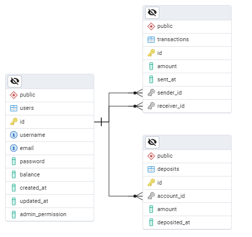

# Bank Account Simulator

A RESTful API project using Flask to simulate the creation, access, monitoring, and management of bank accounts, with features to perform deposits and transactions between accounts.

Under construction